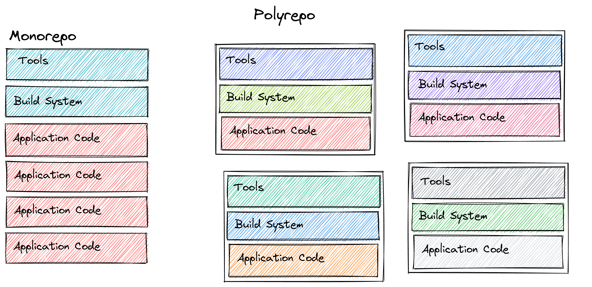

.. _build:

A unified build system
======================

At the core of ``Umii``'s software stack is a single monolithic repository that
is built to contain your entire application code.

In a Monorepo, all your projects use the same tools and are built by the same
build system.

- All projects, even if managed by different teams, adhere to the same set of
  organization-specific coding conventions. New conventions can easily be
  implemented across all projects.
- Since tools are shared among all projects, an upgrade to a tool is
  automatically available to all your projects.
- Maintaining backwards-compatibility for internal projects becomes obsolete
  since every project uses the latest version of all organization-internal
  dependencies.
- Developers can focus on improving the actual application instead of having to
  maintain 10 different versions of the same code.

Builds in ``Umii``'s monorepo are incremental and reproducible per default.

- Reproducible builds harden the build infrastructure against human error and
  malicious attacks.
- Incremental builds trade expensive compilation time for cheap disk space by
  caching build results and reusing already built targets whenever possible.
  Caching can easily speed up build times by 40x and more.

.. admonition:: Techical Details

   The Monorepo is a single ``git`` repository that is integrated with the
   ``Bazel`` build system.

   The current version of the monorepo comes with preconfigured rules for
   ``eomiiOS``'s native compiler toolchains, linters and testing tools for
   targets written in ``C``, ``C++``, ``Go``, ``Rust`` and ``Python``.

   Cross-compilation toolchains for ``ARM64`` and ``Risc-V`` edge devices are
   under construction.
