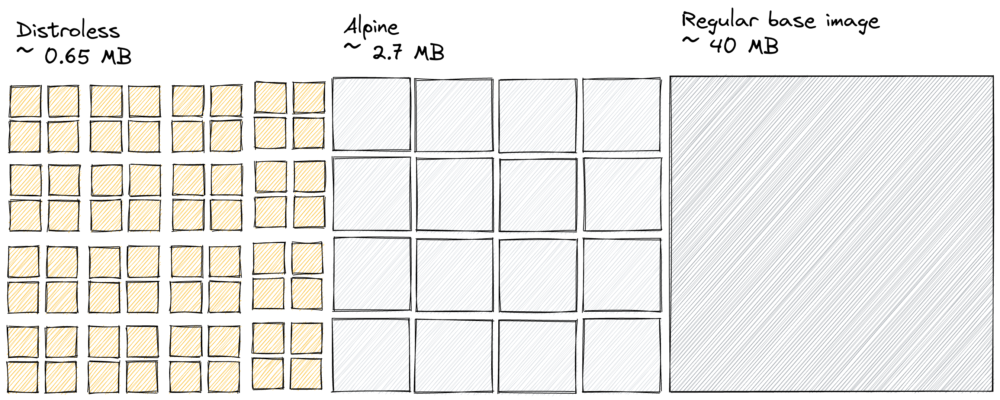

.. _package:

Automated packaging
===================

Binaries need to be packaged so that they can efficiently be deployed. ``Umii``
utilizes containerization rules that are built into the same Monorepo build
system that already builds the application binaries.

- The benefits of the binary build system translate to container builds.
- Containers are handeled as just another build target. This reduces removes
  the complexity having to manage a separate packaging system and image
  repository.

Most application binaries do not require a feature-rich runtime environments.
Packaging anything that is not necessary for the application to run
unnecessarily increases the attack surface and resource consumption of
deployments. We use ``Distroless`` base images per default that contain the
absolute minimum requirements for the application code to run securely.

.. admonition:: Technical Details

   Even though the containerization rules are called ``rules_docker`` for
   historical reasons, they do not utilize Docker in ``Umii``. We use native
   ``tar`` archiving for the image layers that are built using system-native
   archiving tools and do not require any daemons to run.

   ``Distroless`` images contain the application binaries, a certificate
   authority, ``passwd``and ``tzdata``. Different flavours of these images use
   performant language specific runtimes, e.g. the ``Distroless`` baseline for
   ``Go`` binaries requiring a ``C`` standard library comes with ``glibc``
   instead of the often used ``musl``.
